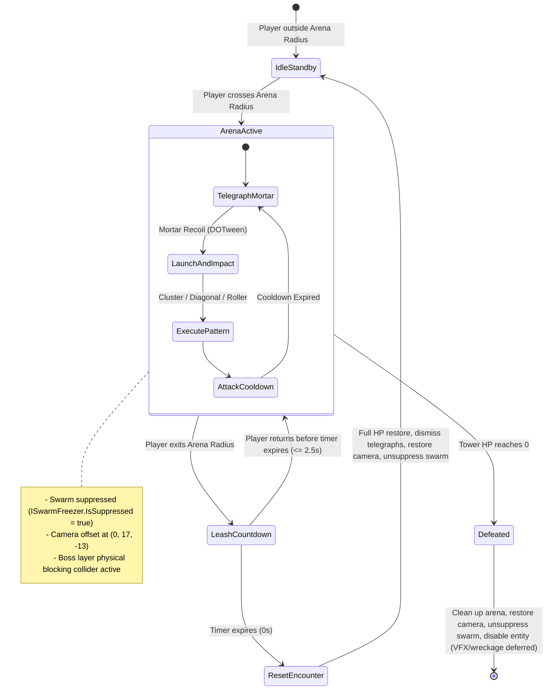

# Brainstorm Brief: Mortar Tower Miniboss Encounter

Date: 2026-09-12

## 1. Context & Motivation

- Feature / Idea: Introduce the first stationary miniboss encounter into Car Survivors: the **Mortar Tower** (Wieża z moździerzem). Unlike the roaming Golem Boss, the Mortar Tower tests player vehicle agility within a bounded combat perimeter.
- Player-Facing Goal: Deliver a high-intensity arena duel where the player car enters the tower's perimeter, triggers a dynamic wide-angle camera view, dodges aerial mortar artillery patterns, and must remain within the arena boundary to prevent the miniboss from fully resetting.
- Impacted Game Systems:
  - Enemies and Bosses / Miniboss architecture
  - Camera System (Cinemachine 3.x FollowOffset dynamic transitions)
  - Arena Boundary / Leash Mechanic (visual perimeter circle and return timer UI)
  - Waves and Swarm Spawning (swarms suppressed via ISwarmFreezer during active encounter)
  - Physics & Collision (Boss layer, impassable physical collider)
  - Navigation & Grid System (walkable cell snapping for artillery impacts)
  - Indicators & Telegraphs (CircularTelegraphIndicator and RectangularTelegraphIndicator)
  - UI & HUD (Boss HUD health bar reuse and leash countdown notification)
  - VFX, Materials, Audio, and DOTween procedural animations

---

## 2. Explored Alternatives & Trade-Offs

### A. Combat Arena Perimeter & Leash Management

#### Option 1 (Selected): Dedicated EncounterArenaController (Math Radius + Grace Period Leash FSM)
- Description: A modular component attached to the tower or arena root that calculates distance squared to the player, drives the visual circle border (scaling up/down with DOTween pulse), monitors boundary exit, and fires events for entering, exiting, countdown tick, reset, and defeat.
- Pros:
  - Clean separation: the tower combat state machine focuses solely on mortar attacks, while the arena controller manages player containment, camera offset, and reset triggers.
  - Frame-rate independent distance check without relying on heavy continuous Unity trigger colliders on fast-moving cars.
  - Reliable leash grace period (e.g. 2.5s) with clean cancellation upon re-entry.
  - Zero GC allocations during radius evaluation.
- Cons / Risks:
  - Requires clean event unsubscription, tween cancellation, and swarm unsuppression if the tower is destroyed mid-countdown.

#### Option 2: 3D Physics Trigger Collider (SphereCollider + OnTriggerExit)
- Description: Placing a large SphereCollider set as trigger to detect player car entry/exit.
- Pros:
  - Standard Unity workflow for basic zones.
- Cons / Risks:
  - High-speed car physics can occasionally tunnel or skip triggers if FixedUpdate steps diverge.
  - Physics trigger matrix overhead when hundreds of swarm enemies are present in the scene.
  - Still requires a separate timer logic for the return countdown.

#### Option 3: Monolithic Tower Script with Inlined Leash Logic
- Description: Embedding distance checks, camera transitions, leash timers, UI calls, and mortar attacks into a single script.
- Pros:
  - Fewer script files created initially.
- Cons / Risks:
  - High coupling, difficult to maintain, breaks single responsibility principle, and impossible to reuse when creating the second planned tower miniboss.

---

### B. Cinemachine Camera Offset Transition

#### Option 1 (Selected): Camera Offset Controller Tweening CinemachineFollow.FollowOffset
- Description: Tweening CinemachineFollow.FollowOffset smoothly from default (0, 11, -7) to arena offset (0, 17, -13) via DOTween with Ease.InOutSine over 0.8s.
- Pros:
  - Reuses the existing active CinemachineCamera in RuinedBloodCity.unity without adding secondary virtual cameras or priority race conditions.
  - Smooth, fully controllable tween duration, easing curve, and interruption handling.
  - Reversible: seamlessly tweens back to (0, 11, -7) when the player exits/resets or defeats the tower.
- Cons / Risks:
  - Must ensure the original offset is cached dynamically at runtime so changes to designer settings in inspector are respected.

#### Option 2: Dual Cinemachine Cameras with Priority Blending
- Description: Spawning/activating a second CinemachineCamera with priority 20 and custom follow offset, relying on Cinemachine Brain blend curves.
- Pros:
  - Native Cinemachine feature.
- Cons / Risks:
  - Cinemachine 3.x asset overhead, extra GameObject in scene, complex hierarchy references, and harder to synchronize with arena border tween durations.

---

### C. Mortar Projectile & Animation Pipeline

#### Option 1 (Selected): Pure DOTween Procedural Animation & DOJump Parabolic Arcs
- Description: No skeletal animator or baked clips. The mortar cannon uses transform punch/kickback tweens on firing. Projectiles use DOJump or parabolic translation curves for aerial arcs and bounces (matching CollectibleDropNotifier). Rolling attack uses DOPath/DOMove with angular rotation and linear hitbox trigger.
- Pros:
  - Matches the user's explicit design request: lightweight, snappy, zero animator controller boilerplate.
  - Full parametric control over arc height, jump power, travel duration, and scatter angle directly from ScriptableObject config.
  - Deterministic timing perfectly synchronized with CircularTelegraphIndicator fill durations.
- Cons / Risks:
  - Sequences must be rigorously killed and pooled projectiles returned if the fight is reset by a leash break.

#### Option 2: Rigidbody Physics Shells with PhysicMaterial Bouncing
- Description: Spawning physics rigidbodies and adding impulse forces to simulate mortar bounce.
- Pros:
  - Realistic physics bouncing.
- Cons / Risks:
  - Unpredictable, non-deterministic landing coordinates that can bounce outside playable boundaries or miss telegraph indicators entirely.
  - Incompatible with the required geometric patterns (concentric rings, diagonal crosses).

---

## 3. Unity & Architecture Considerations

### Data Authoring
- MortarTowerConfigSO: ScriptableObject storing:
  - MaxHealth, EnrageHealthPercent (e.g. 0.40f)
  - ArenaRadius (e.g. 22f), LeashGracePeriodSeconds (e.g. 2.5f)
  - CameraCombatOffset (0, 17, -13), CameraTransitionDuration (0.8f)
  - Attack cooldowns, global recovery delay between attacks
  - Attack 1 parameters (impact radius, 6-point scatter radius, DOJump height, enrage 2-wave rings)
  - Attack 2 parameters (center random offset range, 4-diagonal spread angle, 3-step bounce distance, enrage 3-burst repeat)
  - Attack 3 parameters (mortar drop radius, roll telegraph length, roll speed, roll width, damage)
  - Damage values, hit cooldowns, SFX audio keys, and VFX prefabs

### Physical Collision & Layer Configuration
- The tower possesses an impassable physical collider (BoxCollider / Cylinder / CapsuleCollider).
- Configured on the same collision layer as the Boss (e.g. Boss / Enemy layer with impassable obstacle collision).
- The player car cannot drive through the tower and collides/bounces off its solid chassis.
- The tower base footprint is marked as impassable on the WorldGrid so ground telegraphs and enemy navigation pathfinding steer around it.

### Waves & Swarm Suppression
- Swarm events are suppressed while the player is inside the combat arena / tower encounter is active:
  - `[Inject] private readonly ISwarmFreezer _swarmFreezer;`
  - On arena engagement: `_swarmFreezer.IsSuppressed = true;` (identical to Golem Boss behavior).
  - On leash reset or tower defeat: `_swarmFreezer.IsSuppressed = false;` resuming regular swarm timers.

### Spatial Checks & Walkable Snapping
- Artillery impact points must be validated against the world navigation grid:
  - Center and bounce endpoints use WorldPosToCellConverter.GetCellFromGridByWorldPos.
  - Impassable cells automatically snap to the nearest walkable neighboring cell center (using the spiral search algorithm from CircularTelegraphIndicator).
  - Prevents mortar shells from landing inside impassable buildings, water, or outside map bounds.

### Visual Perimeter Border
- Reuses the visual circular plane pattern established in CapturePoint.cs:
  - A flat mesh/quad on ground level with an unlit border material.
  - When the player enters detection range: scales up from 0 to target arena diameter via DOScale (Ease.OutBack) and begins a subtle breathing pulse tween.
  - When combat ends or resets: shrinks down to 0 via DOScale (Ease.InQuad) and disables.

### Leash Countdown UI Presenter
- New UI presenter ArenaLeashWarningPresenter (or EncounterLeashPresenter):
  - Canvas element showing warning label and dynamic countdown: e.g. "RETURN TO ARENA: 2.5s".
  - Text uses scale punch animation on each full second tick (inspired by SwarmNotificationPresenter).
  - Automatically hides when the player re-enters the arena or when the encounter is reset.

### Boss / Encounter HUD Presenter
- The existing BossHUDPresenter / IBossHUDPresenter can be reused directly:
  - Called via _bossHUDPresenter.Show(towerHealth, "MORTAR TOWER") when combat is initiated.
  - Called via _bossHUDPresenter.Hide() when the leash is broken or upon defeat.

### Defeat Flow & Destruction Handling
- In current milestone:
  - Defeating the tower immediately cleans up the arena border, hides the boss HUD, smoothly restores the camera offset to default (0, 11, -7), unsuppresses swarms, and disables the combat entity.
  - Custom destruction VFX and fractured mesh / wreckage collapse will be added in a future visual pass. No special portal or bonus loot is spawned at this time.

### Zero-GC & Lifecycle Invariants
- All active DOTween sequences, telegraphs, and spawned projectiles must be tracked in an active registry:
  - If player triggers a Leash Reset: cancel all active attack tweens, dismiss all telegraph indicators, return all active shell entities to pool, unsuppress swarms, reset tower health to 100%, and switch tower state to idle.
  - On defeat: unsuppress swarms, smoothly restore camera offset, hide HUD, contract arena border, and deactivate combat entity.

---

## 4. Key Decisions & Detailed Specifications

### A. Combat Lifecycle & State Flow

### B. Attack 1: Cluster Shrapnel Burst (Wystrzał Odłamkowy)
- Targeting: Centered directly on current player car position.
- Step 1 (Central Drop):
  - Mortar barrel pitches up with DOTween recoil punch.
  - Warning: Small circular telegraph (radius ~2.5m) appears on player position for ~1.2s.
  - Shell drops from sky; on impact, deals central explosion damage.
- Step 2 (Radial Scatter):
  - Shell splits into 6 smaller sub-shells.
  - 6 circular telegraphs (radius ~2.0m each) appear in a regular hexagon ring around the center at radius R = 6.0m (angles 0°, 60°, 120°, 180°, 240°, 300° + slight designer jitter).
  - 6 sub-shells launch from center with DOTween DOJump (jump power 4.0m, duration 0.6s) arcing into the target telegraphs.
  - On landing: secondary explosions deal shrapnel damage.
- Enrage Mode Enhancement:
  - Double Bounce Rings: After the first 6 sub-shells explode, they bounce a second time outward (or spawn a secondary expanding ring at R = 11.0m with 6 or 8 circles), creating 2 concentric expanding blast waves.

### C. Attack 2: Diagonal Artillery Line Bounce (Ostrzał Przekątny)
- Targeting: Centered on a random point around the player (offset distance ~6.0m – 10.0m from player, so player is NOT the center and must read the trajectory).
- Step 1 (Central Impact):
  - Fast drop at the offset center (warning ~0.9s).
- Step 2 (Diagonal Straight-Line Bounces):
  - Instead of a circular ring, the blast directs into 4 diagonal directions (like an X-shape / square diagonals: 45°, 135°, 225°, 315° relative to grid/arena).
  - Along each diagonal ray, the shell bounces 3 successive times outward in a straight line:
    - Bounce 1: distance = 3.5m from center.
    - Bounce 2: distance = 7.0m from center.
    - Bounce 3: distance = 10.5m from center.
  - Each bounce step has a small circular telegraph appearing just before the DOJump shell lands.
- Enrage Mode Enhancement:
  - Triple Salvo: The tower fires this attack 3 times in rapid succession (e.g. 0.4s interval between shots), picking 3 distinct offset centers and saturating the arena with criss-crossing diagonal blast waves.

### D. Attack 3: Mortar Rolling Boulder (Toczący się Pocisk)
- Targeting: Targets a spot in the arena, lands, then aims and rolls towards the player.
- Step 1 (Aerial Drop):
  - Circular telegraph appears at landing location (radius ~2.5m, warning ~1.0s).
  - Heavy projectile drops from the sky.
- Step 2 (Linear Roll towards Player):
  - Upon ground impact, a rectangular telegraph projects instantly from the landing spot aiming directly at the player's current position (width ~2.5m, length ~20m).
  - Projectile transforms into rolling mode: rotates around its horizontal axis via DOTween while moving along the linear line at high speed (~18m/s).
  - Collision & Damage: Uses the same linear hitbox / trigger architecture as Golem Boss linear fist (LinearAttackHitbox), checking damage against the player car on contact.
  - At the end of the line, the shell detonates with an explosion VFX and despawns.

### E. Intensity & Phase Progression
- Phase 1 (100% – 40% HP):
  - Standard attack rotation (Attack 1 -> Attack 2 -> Attack 3).
  - Standard cooldowns between attacks (~3.5s – 4.5s).
  - Base mortar DOJump speeds and warning durations.
- Phase 2 – Enrage (< 40% HP):
  - Visual Enrage: Tower materials switch to glowing red/orange emission via MaterialPropertyBlock, chimney/barrel vents fire particles, enrage audio roar/siren triggers.
  - Reduced attack cooldowns (~2.0s – 2.5s).
  - Attack 1 gains 2-wave expanding rings.
  - Attack 2 fires 3 rapid salvos.
  - Attack 3 roll speed increases by 35%.

### F. Settled Design Parameters

| Parameter | Value | Note |
|---|---|---|
| Tower Max Health | 5000 HP | Balanced for mid-game survivor build |
| Enrage Threshold | 40% Max HP | Triggers visual enrage & enhanced attacks |
| Physical Collision Layer | Boss Layer | Impassable solid collider; player car cannot drive through |
| Swarm Suppression | Active during combat | `ISwarmFreezer.IsSuppressed = true` (same as Golem Boss) |
| Arena Radius | 22.0 meters | Circumscribed combat circle |
| Leash Return Grace Time | 2.5 seconds | Countdown before full encounter reset |
| Normal Camera Offset | (0, 11, -7) | Scene default follow offset |
| Combat Camera Offset | (0, 17, -13) | Elevated wide-view combat follow offset |
| Camera Transition Time | 0.8 seconds | DOTween Ease.InOutSine |
| Attack 1 Sub-projectiles | 6 shells | Arranged in hexagonal radial pattern |
| Attack 2 Bounce Steps | 3 bounces per diagonal | 4 diagonal rays (12 impact points total) |
| Attack 2 Enrage Salvos | 3 repetitions | Rapid succession offset barrages |
| Attack 3 Roll Speed | 16 m/s (22 m/s Enraged) | Linear roll towards player vehicle |
| Defeat Rewards / VFX | Minimal cleanup | Entity despawns, UI hides; VFX & wreckage deferred to future pass |

---

## 5. Next Step & Implementation Scope

- Recommended Next Skill: gameplay-spec-writing (to produce the comprehensive technical specification and implementation plan before coding).
- Target Implementation Scope:
  - Assets/Scripts/Enemies/Bosses/Towers/MortarTower/MortarTowerBoss.cs
  - Assets/Scripts/Enemies/Bosses/Towers/MortarTower/MortarTowerConfigSO.cs
  - Assets/Scripts/Enemies/Bosses/Towers/MortarTower/MortarTowerStateMachine.cs
  - Assets/Scripts/Enemies/Bosses/Towers/MortarTower/States/
  - Assets/Scripts/Enemies/Bosses/Towers/MortarTower/Projectiles/
  - Assets/Scripts/Enemies/Bosses/Towers/Arena/EncounterArenaController.cs
  - Assets/Scripts/Camera/CinemachineCombatFollowOffsetController.cs
  - Assets/Scripts/UI/HUD/ArenaLeashWarningPresenter.cs
  - Assets/Scripts/ReflexDI/DefaultGameplaySceneInstaller.cs
  - Prefabs and ScriptableObject assets under Assets/Prefabs/Enemies/Bosses/ and Assets/ScriptableObjects/Enemies/Bosses/
