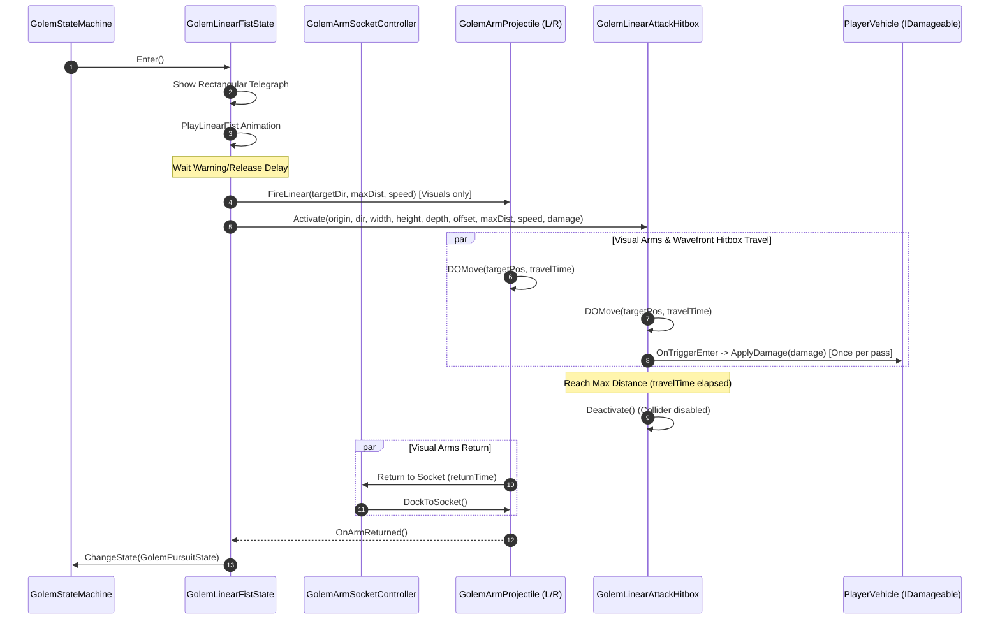

# Specification: Golem Boss Linear Attack Hitbox System & Arm Collider Decoupling

**Date:** 2026-08-25  
**Author:** Antigravity (Advanced Agentic Assistant)  
**Target Systems:** Assets/Scripts/Enemies/Bosses/Golem/, Assets/Prefabs/Enemies/Bosses/Golem/

---

## 1. Overview & Player Experience

### Summary
During the Ancient Golem boss encounter, the Golem performs a horizontal dual rocket arm punch ("Linear Rocket Fists"). Previously, collision detection was coupled directly to narrow individual colliders on the detachable arm projectile meshes. This was unintuitive in combat, as players standing inside the telegraphed lane (e.g., between the fists or near the lane edges) could escape damage, while the physical shapes of the arm models did not correspond well to player expectations.

This feature introduces a dedicated, indicator-aligned attack hitbox system (`GolemLinearAttackHitbox`) and completely decouples collision/damage from the arm projectile meshes (`GolemArmProjectile`):
1. **Indicator-Synchronized Wavefront Hitbox:** A dedicated `BoxCollider` trigger spanning the full width of the rectangular telegraph (`LinearFistWidth`) advances synchronously with the flying hands from the boss origin to `LinearFistMaxDistance` at `LinearFistSpeed * CurrentArmSpeedMultiplier`.
2. **Complete Removal of Arm Mesh Colliders:** The `GolemArmProjectile` component no longer requires or manages physical colliders. Boss hands become pure visual projectiles (controlling rigged meshes, detached transforms, trails, and impact VFX). All gameplay damage is strictly driven by the indicators:
   - **Horizontal Linear Fists:** Driven by the advancing `GolemLinearAttackHitbox` along the rectangular telegraph lane.
   - **Sky Barrage:** Driven by `Physics.OverlapSphere` in `DropFromSky` at the circular telegraph landing position.
   - **Melee Stomp / Leap Slam:** Driven by foot stomp trigger / circular ground slam overlap sphere.

### Player-Facing Goals
- **100% Indicator-Grounded Fairness:** If a player vehicle is inside the red rectangular telegraph lane, damage is applied strictly when the advancing attack wavefront reaches their position along the lane.
- **No Inconsistent Gaps:** No safe spots exist between the two flying fists or along the edges inside the rectangular telegraph boundary.
- **Dynamic Wavefront Timing:** Players at the far end of the attack corridor have time to react and maneuver out of the telegraph before the advancing hitbox reaches them.
- **Clean Visual Separation:** Arm meshes act as visual representations of the attack without collision glitches or physics artifacts.

### In-Scope vs. Out-of-Scope
- **In-Scope:**
  - Creation of `GolemLinearAttackHitbox` component (`IGolemLinearAttackHitbox`) with configurable width, height, and depth.
  - Synchronization of the wide hitbox position with the forward thrust progression of the rocket arms in `GolemLinearFistState`.
  - Single-hit deduplication per attack pass (player is damaged exactly once per outward thrust).
  - Immediate deactivation upon reaching maximum range and during arm return/docking.
  - Refactoring `GolemArmProjectile.cs` to remove `[RequireComponent(typeof(Collider))]`, `_damageCollider`, and `OnTriggerEnter`, allowing complete removal of colliders from arm prefabs.
  - Integration on the `GolemBoss` prefab and serialization wiring.
- **Out-of-Scope:**
  - Changing `GolemSkyBarrageState` or `GolemLeapSlamState` indicator mechanics.
  - Modifying base vehicle controller physics or vehicle layer settings.
  - Boss visual mesh redesign.

---

## 2. Open Questions & Resolved Decisions

### Resolved Decisions
- [x] **Hitbox Delivery Mechanism (Option 1 Selected):** A dedicated `GolemLinearAttackHitbox` child object on `GolemBoss` with a `BoxCollider` (`isTrigger = true`) and kinematic `Rigidbody`. When `FireFists` is triggered, it positions at boss origin, aligns to `_attackDirection`, and translates forward synchronously with the arms via DOTween over `travelTime = maxDistance / speed`.
- [x] **Complete Removal of Arm Colliders:** All colliders on `GolemArmProjectile` and arm prefabs (`Golem_L_Arm_Projectile.prefab`, `Golem_R_Arm_Projectile.prefab`) are completely eliminated. The code will remove `[RequireComponent(typeof(Collider))]` and collider-enabling logic from `GolemArmProjectile.cs`.
- [x] **Full-Width Attack Coverage:** The attack hitbox width strictly matches `_boss.Config.LinearFistWidth` (the exact width rendered by `RectangularTelegraphIndicator`).
- [x] **Hitbox Vertical Dimensions:** Default height is set to `2.5f` with a vertical center offset of `1.0f` (configurable in `GolemBossConfigSO`), ensuring reliable collision with low cars, standard cars, and trucks across terrain elevation changes.
- [x] **Hitbox Depth:** Wavefront depth is set to `1.5f` (configurable), providing a solid volume that prevents fast-moving vehicles from tunneling through between physics ticks.
- [x] **No Damage on Return:** The hitbox is deactivated the moment the forward thrust completes; returning arms do not deal damage.
- [x] **Single-Hit Per Attack Pass:** The system maintains a pre-allocated cache of hit entities per thrust pass to guarantee a player vehicle takes damage at most once per linear attack.
- [x] **Zero Allocation Physics Checks:** Uses trigger events (`OnTriggerEnter`) combined with non-alloc overlap checks; zero runtime allocations in `Update`/`FixedUpdate`.

### Open Questions
*All open design questions have been resolved.*

---

## 3. Data Model & Serialization

### ScriptableObjects
`GolemBossConfigSO` (`Assets/ScriptableObjects/Enemy/Bosses/Golem/GolemBossConfigSO.cs`):
- Uses existing fields:
  - `_linearFistSpeed` (e.g. `30f`)
  - `_linearFistMaxDistance` (e.g. `20f`)
  - `_linearFistDamage` (e.g. `40f`)
  - `_linearFistWidth` (e.g. `2f` - `3.5f`)
- New configuration fields for hitbox tuning:
  - `[SerializeField] private float _linearFistHitboxHeight = 2.5f;`
  - `[SerializeField] private float _linearFistHitboxDepth = 1.5f;`
  - `[SerializeField] private float _linearFistHitboxVerticalOffset = 1.0f;`

### Serialized Fields & Prefab Structure
`GolemBoss.prefab` (`Assets/Prefabs/Enemies/Bosses/Golem/GolemBoss.prefab`):
- Child GameObject: `LinearAttackHitbox` containing `GolemLinearAttackHitbox`, `BoxCollider` (`isTrigger = true`), and `Rigidbody` (`isKinematic = true`).
- Serialized reference on `GolemBoss.cs`:
  ```csharp
  [SerializeField] private GolemLinearAttackHitbox _linearAttackHitbox;
  ```
- `Golem_L_Arm_Projectile.prefab` and `Golem_R_Arm_Projectile.prefab`:
  - Colliders can be safely removed or disabled on the arm prefabs.

---

## 4. Architecture & Contracts

### Interface Definition
Colocated in `Assets/Scripts/Enemies/Bosses/Golem/Combat/GolemLinearAttackHitbox.cs`:

```csharp
namespace Assets.Scripts.Enemies.Bosses.Golem.Combat
{
    public interface IGolemLinearAttackHitbox
    {
        bool IsActive { get; }
        void Activate(Vector3 origin, Vector3 direction, float width, float height, float depth, float verticalOffset, float maxDistance, float speed, float damage, Action onComplete = null);
        void Deactivate();
    }
}
```

### Decoupled Arm Projectile Contract
`GolemArmProjectile.cs` (`Assets/Scripts/Enemies/Bosses/Golem/Arms/GolemArmProjectile.cs`):
- Pure visual projectile controller:
  - `DockToSocket()`: Resets transform, disables GameObject, shows rigged mesh.
  - `FireLinear(targetDirection, maxDistance, speed, onComplete)`: Animates forward and return motion via DOTween with trails and VFX.
  - `LaunchToSky(launchHeight, duration, onSkyReached)`: Animates launch upward.
  - `DropFromSky(targetSlamPosition, fallSpeed, damage, impactRadius, onImpact)`: Drops downward and executes `Physics.OverlapSphere` at impact.
  - `ReturnAndDock(duration, onDocked)`: Smoothly tweens back to boss socket.
  - *Removed:* `[RequireComponent(typeof(Collider))]`, `_damageCollider`, `_hasDealtDamageThisFlight`, and `OnTriggerEnter`.

### Flow and Coordination


---

## 5. Visual, Audio & Tweening Integration

- **Wavefront Motion Synchronization:** Driven by a DOTween `Sequence` running in parallel with `GolemArmProjectile.FireLinear`, with exact duration `maxDistance / speed`.
- **Collider Lifecycle:** The `BoxCollider` is enabled strictly during forward motion; disabled immediately upon arrival at `maxDistance` or upon `Exit()` / `Deactivate()`.
- **Audio / VFX:** Leverages existing `ROCKET_SFX_KEY` and damage numbers spawner upon player impact.

---

## 6. Edge Cases, Performance & Lifecycle Invariants

- **Zero Allocation Invariant:** Hit tracking uses a reusable `HashSet<Collider>` cleared on `Activate()`; zero heap allocations in `Update`/`FixedUpdate`.
- **Boss Interruption / Death:** If Golem HP reaches 0 while fists are in flight, `GolemBoss.OnDisable()` / `GolemLinearFistState.Exit()` calls `Hitbox.Deactivate()`, killing the active tween and disabling the trigger.
- **Fast Car Crossing:** Hitbox depth (`1.5f`) and kinematic Rigidbody ensure Unity physics continuous contact evaluation detects high-velocity vehicle sweeps.
- **Layer Masking:** Filtered strictly against `EntityLayers.Player`.

---

## 7. Implementation Plan (Phases & Steps)

### Phase 1: Data Model & Hitbox Component
- [ ] **Step 1.1:** Add hitbox dimension settings (`_linearFistHitboxHeight`, `_linearFistHitboxDepth`, `_linearFistHitboxVerticalOffset`) to `GolemBossConfigSO.cs` with property getters.
  - Files: `Assets/ScriptableObjects/Enemy/Bosses/Golem/GolemBossConfigSO.cs`
- [ ] **Step 1.2:** Implement `GolemLinearAttackHitbox.cs` and `IGolemLinearAttackHitbox` with dynamic BoxCollider sizing, DOTween forward movement, damage application, and single-hit deduplication.
  - Files: `Assets/Scripts/Enemies/Bosses/Golem/Combat/GolemLinearAttackHitbox.cs`
  - Verification: `dotnet build Assembly-CSharp.csproj -p:BuildProjectReferences=false`

### Phase 2: Decouple Arm Colliders & State Integration
- [ ] **Step 2.1:** Refactor `GolemArmProjectile.cs` to remove `[RequireComponent(typeof(Collider))]`, `_damageCollider`, and `OnTriggerEnter`, simplifying `FireLinear` signature and lifecycle.
  - Files: `Assets/Scripts/Enemies/Bosses/Golem/Arms/GolemArmProjectile.cs`
- [ ] **Step 2.2:** Expose `LinearAttackHitbox` on `IGolemBoss.cs` and serialize reference in `GolemBoss.cs`.
  - Files: `Assets/Scripts/Enemies/Bosses/Golem/IGolemBoss.cs`, `Assets/Scripts/Enemies/Bosses/Golem/GolemBoss.cs`
- [ ] **Step 2.3:** Update `GolemLinearFistState.cs` to trigger `LinearAttackHitbox.Activate` in `FireFists` and `LinearAttackHitbox.Deactivate` in `Exit`.
  - Files: `Assets/Scripts/Enemies/Bosses/Golem/StateMachine/States/GolemLinearFistState.cs`

### Phase 3: Verification & Documentation
- [ ] **Step 3.1:** Compile check via `dotnet build Assembly-CSharp.csproj -p:BuildProjectReferences=false` with 0 errors and 0 warnings.
- [ ] **Step 3.2:** Update `golem-boss-system.md` documentation to reflect the indicator-aligned hitbox system and arm collider decoupling.
  - Files: `.agents/context/game-systems/golem-boss-system.md`
- [ ] **Step 3.3:** Document Unity Editor prefab setup and verification steps for playtesting.

---

## 8. Verification & Acceptance Criteria

- [ ] Solution compiles cleanly with zero warnings: `dotnet build Assembly-CSharp.csproj -p:BuildProjectReferences=false`.
- [ ] Coding standards strictly followed (`_camelCase` private/serialized fields, explicit field order, `[SerializeField] private`).
- [ ] Arm prefabs (`Golem_L_Arm_Projectile.prefab`, `Golem_R_Arm_Projectile.prefab`) function without requiring any colliders.
- [ ] Player standing anywhere across `LinearFistWidth` inside the rectangular telegraph takes damage when the rocket arms reach their position.
- [ ] Player is never hit twice by a single rocket arm launch pass.
- [ ] No lingering triggers or orphaned tweens when the boss dies or transitions to another state.
