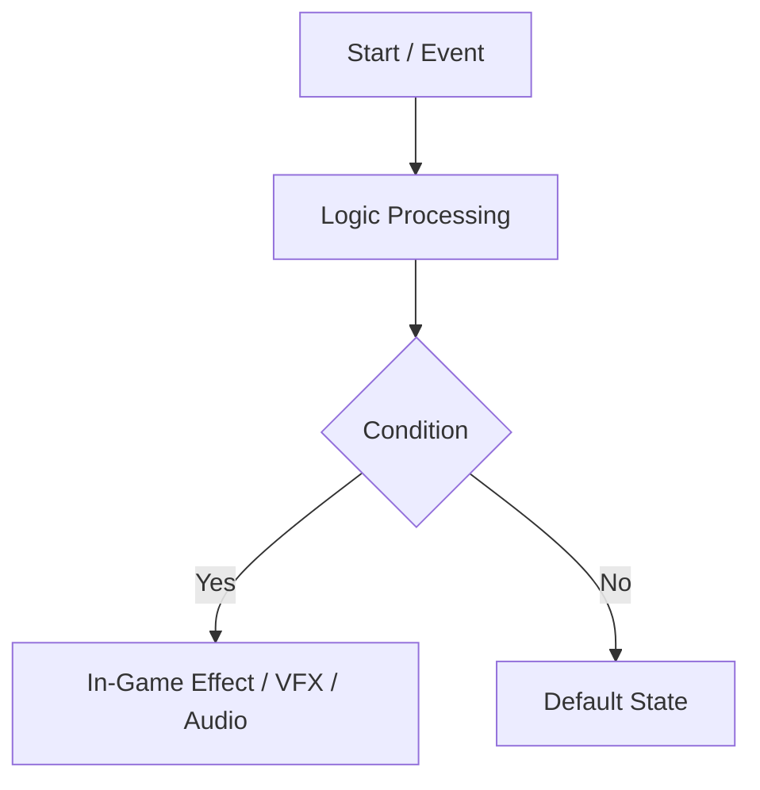

# <Topic / System Name>

*Brief 1-2 sentence summary: what this element is and what role it plays in the game.*

---

## 1. Overview & Purpose

Accessible explanation covering:
- What problem this system/feature solves.
- How it affects gameplay from player and developer perspectives.
- Intuitive analogies to aid understanding.

## 2. Key Concepts

Glossary of key terms:
- **Concept A**: Simple and concise explanation.
- **Concept B**: Simple and concise explanation.

## 3. How It Works

Visual flowchart of system operation:

Step-by-step description of what happens at each stage.

## 4. Designer & Configuration Guide

Practical guide for designers and developers:
1. **Asset Locations**: Where prefabs, ScriptableObjects, and scenes are located.
2. **Step-by-Step**: How to create a new element (e.g. new weapon, enemy type, upgrade).
3. **Tips & Best Practices**: What to watch out for during Unity Inspector configuration.

## 5. Parameter & Balance Table

| Inspector Parameter | Description | Default Values / Recommended Range |
| :--- | :--- | :--- |
| `Example_Parameter1` | Parameter description | e.g. 1.0 - 5.0 |
| `Example_Parameter2` | Parameter description | e.g. `True` / `False` |

## 6. FAQ & Troubleshooting

- **Q: What should I do when [common issue]?**  
  **A:** [Step-by-step resolution].
- **Q: Can I modify [parameter X] at runtime?**  
  **A:** [Explanation of runtime behavior].
