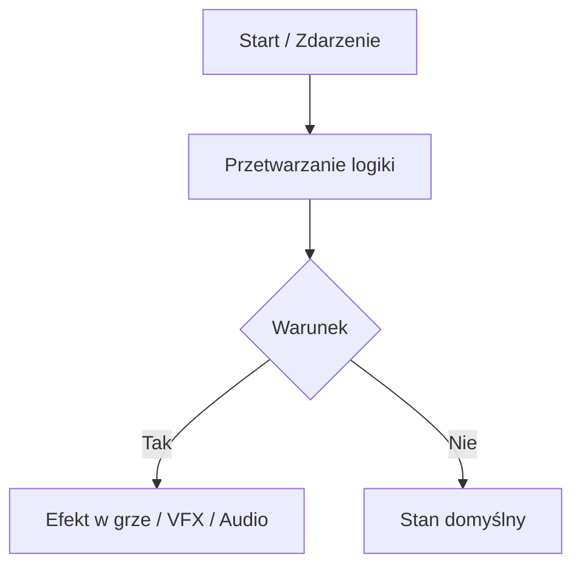

# <Topic / System Name>

*Krótkie podsumowanie w 1-2 zdaniach: czym jest ten element i jaką rolę pełni w grze.*

---

## 1. Wprowadzenie i Cel (Overview)

Opis w przystępnym języku wyjaśniający:
- Jaki problem rozwiązuje ten system / funkcja.
- Jak wpływa na rozgrywkę z perspektywy gracza i developera.
- Intuicyjne analogie ułatwiające zrozumienie.

## 2. Kluczowe Pojęcia (Key Concepts)

Słowniczek najważniejszych terminów:
- **Pojęcie A**: Wyjaśnienie proste i zwięzłe.
- **Pojęcie B**: Wyjaśnienie proste i zwięzłe.

## 3. Schemat Działania (How It Works)

Wizualny przepływ działania systemu:

Opis krok po kroku co dzieje się na poszczególnych etapach.

## 4. Przewodnik Konfiguracji (Designer Guide)

Praktyczny poradnik dla projektanta / programisty:
1. **Lokalizacja assetów**: Gdzie znajdują się prefabrykaty, ScriptableObjecty i sceny.
2. **Krok po kroku**: Jak stworzyć nowy element (np. nową broń, typ wroga, ulepszenie).
3. **Wskazówki i dobre praktyki**: Na co zwracać uwagę podczas konfiguracji w Inspektorze Unity.

## 5. Tabela Parametrów i Balansu (Parameters)

| Parametr w Inspektorze | Znaczenie | Wartości domyślne / Zalecany zakres |
| :--- | :--- | :--- |
| `Przykład_Parametr1` | Opis parametru | np. 1.0 - 5.0 |
| `Przykład_Parametr2` | Opis parametru | np. `True` / `False` |

## 6. Najczęstsze Pytania i Rozwiązywanie Problemów (FAQ & Troubleshooting)

- **P: Co zrobić, gdy [częsty problem]?**  
  **O:** [Rozwiązanie krok po kroku].
- **P: Czy mogę zmienić [parametr X] w trakcie gry?**  
  **O:** [Wyjaśnienie zachowania w runtime].
