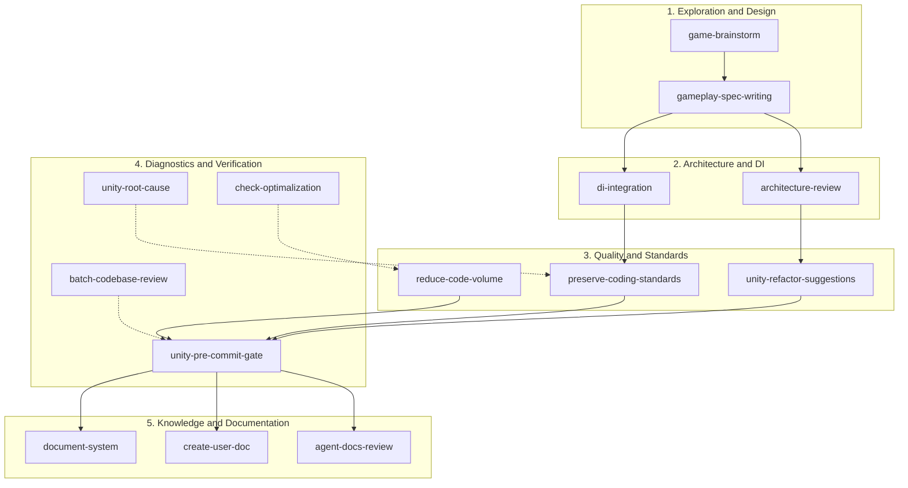
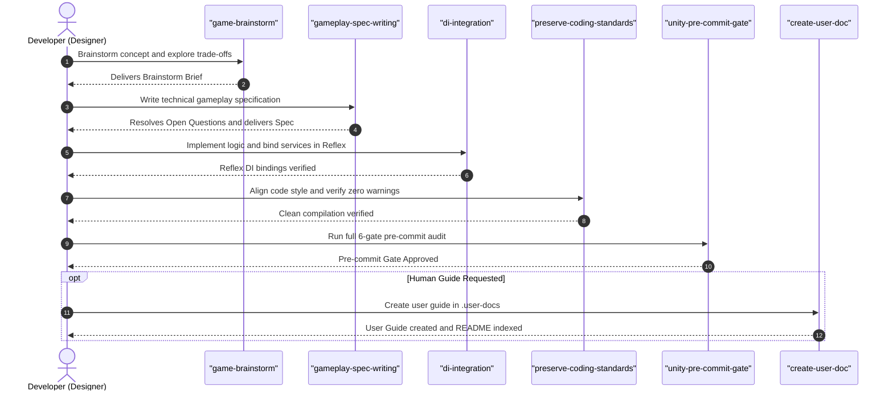

# Car Survivors Agent Skills Guide

A comprehensive, human-facing guide for game designers, programmers, and technical leads on the AI Agent Skills available in the *Car Survivors* repository.

---

## 1. Overview & Purpose

In the *Car Survivors* project, **Skills** are specialized, domain-specific operational workflows and instructions designed for AI coding assistants (such as Gemini, Antigravity, or OpenAI). 

Rather than relying on generic, unconstrained AI responses, skills enforce strict engineering standards, architectural boundaries, and safety invariants specific to Unity and C#.

### Why Use Agent Skills?
- **Architectural Integrity**: Safeguards Reflex Dependency Injection (DI) boundaries and prevents singleton patterns or direct scene lookups.
- **Engine Safety**: Prevents runtime race conditions, broken Unity serialization, unmanaged DOTween memory leaks, and GC allocations in update loops.
- **Deterministic Workflows**: Standardizes exploratory brainstorming, technical specifications, refactoring, code quality audits, and pre-commit verification gates.
- **Zero-Guesswork Execution**: Grounded directly in repository source code, architecture decision records (ADRs), and project coding guidelines.

---

## 2. Skill Domains & Lifecycle

The 14 repository skills are organized into 5 core engineering domains covering the entire game development lifecycle:



1. **Exploration & System Design**: Divergent gameplay design exploration and formal technical specifications before writing code.
2. **Architecture & Dependency Injection**: Reflex DI container wiring, interface definitions, and dependency boundary audits.
3. **Code Quality & Standards**: Style alignment, line-of-code reduction, and behavior-preserving refactor suggestions.
4. **Diagnostics, Performance & Verification**: Read-only defect investigation, frame-rate/GC audits, batch reviews, and pre-commit compiler gates.
5. **Documentation & Knowledge Management**: Technical system documentation, agent context maintenance, and human-facing guides.

---

## 3. Master Skills Reference Table

| Skill Name | Domain | Core Purpose | Primary Triggers & Keywords | Primary Deliverable | Read-Only? |
| :--- | :--- | :--- | :--- | :--- | :---: |
| **`game-brainstorm`** | Exploration & Design | Explore gameplay ideas, weapon concepts, balance choices, and architectural trade-offs before writing code. | `brainstorm`, `game design idea`, `should we build this`, `weapon concept` | Brainstorm Brief (`brainstorm-brief.md`) | **Yes** |
| **`gameplay-spec-writing`** | Exploration & Design | Author staff-engineer level technical specifications and implementation plans with hard Open Questions gates. | `write spec`, `feature spec`, `gameplay spec`, `technical specification` | Gameplay Specification (`[feature]-spec.md`) | **Yes** |
| **`di-integration`** | Architecture & DI | Integrate Reflex DI bindings, scene installers, and dependency injection while removing singleton patterns. | `di integration`, `reflex binding`, `add dependency`, `scene installer` | Injected services & Reflex bindings | No |
| **`architecture-review`** | Architecture & DI | Audit system changes against Reflex DI rules, dependency directions, DOTween lifecycles, and serialization safety. | `architecture review`, `audit di`, `lifecycle check`, `breaking change check` | Architecture Review Report | **Yes** |
| **`preserve-coding-standards`** | Quality & Standards | Audit and automatically align scoped C# files with repository naming, ordering, and block syntax rules. | `preserve coding standards`, `coding standards cleanup`, `style drift` | Automated standards fixes + compile gate | No |
| **`reduce-code-volume`** | Quality & Standards | Safely reduce boilerplate, lines of code, and redundancy while preserving serialization and DI. | `reduce code volume`, `reduce code size`, `minimize lines of code` | Refactored, streamlined C# scripts | No |
| **`unity-refactor-suggestions`** | Quality & Standards | Provide 4-tier categorized refactoring recommendations and diffs for a selected system or script. | `refactor`, `cleanup`, `unity best practices`, `reduce complexity` | Refactor Suggestion Report | **Yes** |
| **`unity-root-cause`** | Diagnostics & Verification | Systematically trace bugs, exceptions, and anomalies to their exact root cause without speculative code edits. | `root cause`, `investigate bug`, `find bug`, `null reference exception` | Root Cause Report (`root-cause-report.md`) | **Yes** |
| **`check-optimalization`** | Diagnostics & Verification | Audit hot paths for GC pressure (heap allocations in `Update`), physics queries, pooling, and frame-rate bottlenecks. | `check optimalization`, `performance audit`, `gc allocations`, `profile hot path` | Optimization Review Report | **Yes** |
| **`unity-pre-commit-gate`** | Diagnostics & Verification | Execute a mandatory 6-gate pre-commit audit (clean C# build, zero warnings, DI bindings, serialization safety). | `pre-commit gate`, `check and commit`, `verify build`, `pre-merge check` | Pre-Commit Gate Checklist | **Yes** |
| **`batch-codebase-review`** | Diagnostics & Verification | Orchestrate and track multi-domain codebase reviews across all project batches with checkpoints and subagents. | `batch codebase review`, `partition codebase review`, `parallel audit` | Batch Plan & Handoff State Machine | No |
| **`document-system`** | Documentation | Create or update technical architecture documentation for a specific game system in `.agents/context/game-systems/`. | `document system`, `document flowfield`, `document car controller` | Game System Technical Doc (`*-system.md`) | No |
| **`create-user-doc`** | Documentation | Create or update human-oriented documentation, guides, or manuals in `.user-docs/` upon explicit user request. | `create user doc`, `user guide`, `explain system for humans` | User Documentation (`.user-docs/*.md`) | No |
| **`agent-docs-review`** | Documentation | Review, trim, and verify AI agent context files in `.agents/` against actual code to eliminate stale guidance. | `agent docs review`, `make docs agent-friendly`, `trim agent docs` | Grounded, concise agent documentation | No |

---

## 4. Detailed Skill Breakdown

### 4.1. `game-brainstorm`
- **Domain**: Exploration & Design
- **Role**: Divergent design and architectural brainstorming partner.
- **Safety Gate**: **Read-Only Gate**. Does not modify code or assets during the brainstorming phase.
- **Inputs**: High-level mechanic idea, balance challenge, weapon concept, or system question.
- **Workflow**:
  1. Frames the topic and classifies the request (mechanic, weapon, enemy, balance, UI, architecture).
  2. Proposes at least two viable alternatives plus the simple/baseline approach.
  3. Evaluates alternatives across Player Feel ("Juice"), Architecture & DI, Performance, and Designer Usability.
  4. Converges on recommendations and produces a structured Brainstorm Brief.
- **Recommended Follow-up**: Hand off to `gameplay-spec-writing` to author the technical specification.

### 4.2. `gameplay-spec-writing`
- **Domain**: Exploration & Design
- **Role**: Staff-engineer level gameplay specification author.
- **Safety Gate**: **Open Questions Hard Gate**. Pauses at a skeleton draft with an open questions block to align on critical design/balance choices before writing detailed steps.
- **Inputs**: Feature concept, mechanic requirements, or accepted brainstorm brief.
- **Workflow**:
  1. Identifies touched domains, existing interfaces, and ScriptableObjects.
  2. Drafts minimal skeleton spec with numbered open questions.
  3. Pauses for user alignment on balance formulas and serialization choices.
  4. Authors complete technical specification (Data Models, Contracts, Reflex DI Wiring, Lifecycle Guardrails, Atomic Phases).
  5. Saves spec in `.agents/context/implementations/plans/[feature]-spec.md`.

### 4.3. `di-integration`
- **Domain**: Architecture & Dependency Injection
- **Role**: Reflex DI integration and dependency wiring specialist.
- **Safety Gate**: Ensures zero singletons, explicit interface bindings, and proper `[Inject]` ordering.
- **Inputs**: Target feature/service, consumer scripts, owning domain, and binding scope (Scene vs Project).
- **Workflow**:
  1. Determines the owning domain and defines/reuses a narrow interface (`I...`).
  2. Registers the service in the appropriate installer (`SceneInstaller` or `BootInstaller`).
  3. Injects dependencies into consumer MonoBehaviours as `[Inject] private` fields.
  4. Enforces field order: `[Inject]` -> `[SerializeField]` -> private fields.
  5. Removes legacy direct lookups (`FindAnyObjectByType`) cleanly.

### 4.4. `architecture-review`
- **Domain**: Architecture & Dependency Injection
- **Role**: Architectural auditor for dependency directions, lifecycle leaks, and breaking changes.
- **Safety Gate**: Evaluates changes against a 4-tier severity model (`Blocker`, `Major`, `Minor`, `Nit`).
- **Inputs**: Target system/feature, modified C# files, planned architectural changes.
- **Workflow**:
  1. Inspects dependency directions (ensures gameplay logic does not depend on UI presenters).
  2. Runs compilation check (`dotnet build`).
  3. Audits Reflex DI registrations, event unsubscriptions (`OnDisable`/`OnDestroy`), and DOTween cleanup.
  4. Applies the Unity Breaking Change Matrix (serialization, DI signatures, lifecycle order).
  5. Delivers structured verdict (`Approve` vs `Request Changes`).

### 4.5. `preserve-coding-standards`
- **Domain**: Code Quality & Standards
- **Role**: Automated coding standards audit and self-correction engine.
- **Safety Gate**: **Mandatory Compilation Gate**. Automatically executes `dotnet build` and fixes any compiler warnings/errors until 100% green.
- **Inputs**: Target folder, script, or system scope.
- **Workflow**:
  1. Inventories target files and scans for standards drift.
  2. Fixes field ordering (`[Inject]` -> `[SerializeField]` -> private).
  3. Fixes naming conventions (`_camelCase` private fields, `UPPER_SNAKE_CASE` constants in `Constants/` folders, `OnX` events).
  4. Enforces method block syntax `{}` and removes LINQ usages.
  5. Executes `dotnet build Assembly-CSharp.csproj -p:BuildProjectReferences=false` to verify zero warnings.

### 4.6. `reduce-code-volume`
- **Domain**: Code Quality & Standards
- **Role**: Safely simplifies code, eliminates boilerplate, and reduces lines of code (LOC).
- **Safety Gate**: Preserves serialized field names, DI boundaries, and readability.
- **Inputs**: Target verbose script, class, or system.
- **Workflow**:
  1. Identifies repetitive checks, redundant loops, and verbose boilerplate.
  2. Applies modern C# idioms (pattern matching, null-coalescing `??`, expression-bodied properties, tuple deconstruction).
  3. Extracts reusable helpers and reuses existing extensions (e.g., `TransformTweenExtensions`).
  4. Cleans unused imports, dead methods, and empty Unity lifecycle hooks.
  5. Verifies build with `dotnet build`.

### 4.7. `unity-refactor-suggestions`
- **Domain**: Code Quality & Standards
- **Role**: Expert advisor for clean code refactoring in Unity.
- **Safety Gate**: **Read-Only Gate**. Generates reviewable suggestions and code diffs without modifying code unprompted.
- **Inputs**: Target script or gameplay system, refactoring goal, and constraints.
- **Workflow**:
  1. Analyzes target against Unity Best Practices, Reflex DI rules, and memory safety.
  2. Categorizes recommendations into 4 severity tiers (`Blocker`, `Major`, `Minor`, `Nit`).
  3. Provides exact, reviewable before/after code snippets and rationale.
  4. Outlines step-by-step verification instructions for the developer.

### 4.8. `unity-root-cause`
- **Domain**: Diagnostics & Verification
- **Role**: Systematic, evidence-grounded Unity bug detective.
- **Safety Gate**: **Read-Only Gate**. Does not make speculative edits while diagnosing bugs.
- **Inputs**: Bug description, exception call stack, reproduction steps, or anomalous gameplay behavior.
- **Workflow**:
  1. Ingests symptoms and traces execution flow from entry triggers (events, update loops, collisions).
  2. Categorizes defect (Logic/State, Reflex DI, Lifecycle/Race Condition, Pooling State Leak, Serialization, Dangling Event).
  3. Inspects dependencies, lifecycle hooks (`Awake` vs `Start`), and tween cleanup.
  4. Pinpoints the exact root cause with line references.
  5. Defines a minimal, zero-regression fix plan.

### 4.9. `check-optimalization`
- **Domain**: Diagnostics & Verification
- **Role**: Performance, frame-rate, and GC allocation auditor.
- **Safety Gate**: **Read-Only Gate**. Proposals must be reviewed and approved before implementation.
- **Inputs**: Target system, update loops, physics routines, or combat/UI flows.
- **Workflow**:
  1. Traces hot paths (routines called 60+ times per second or per-unit-per-frame).
  2. Audits for heap allocations (LINQ, `new`, string formatting, boxing) in `Update`/`FixedUpdate`.
  3. Inspects pooling usage for dynamic objects (projectiles, damage numbers, enemy VFX).
  4. Checks physics query efficiency (layer masks, non-alloc methods).
  5. Generates structured optimization report with Severity and Expected Impact ratings.

### 4.10. `unity-pre-commit-gate`
- **Domain**: Diagnostics & Verification
- **Role**: Strict quality gatekeeper before committing changes or opening PRs.
- **Safety Gate**: Enforces all 6 verification gates (Compilation, Serialization Safety, Reflex DI, Coding Standards, Git State, Documentation Lifecycle).
- **Inputs**: Current git branch / working directory diff.
- **Workflow**:
  1. Gate 1: Runs `dotnet build Assembly-CSharp.csproj -p:BuildProjectReferences=false` (must pass with 0 errors, 0 warnings).
  2. Gate 2: Verifies serialized field integrity (`_camelCase`, `[SerializeField] private`).
  3. Gate 3: Verifies all `[Inject]` interfaces have installer bindings and correct ordering.
  4. Gate 4: Audits constants, events, LINQ ban, and pooling rules.
  5. Gate 5: Checks `git status` for untracked files and cleanliness.
  6. Gate 6: Verifies implementation summary exists under `.agents/context/implementations/summaries/`.

### 4.11. `batch-codebase-review`
- **Domain**: Diagnostics & Verification / Orchestration
- **Role**: Multi-agent coordinator for repository-wide audits and migrations.
- **Safety Gate**: Checkpoint-based state machine with compilation gates after every batch.
- **Inputs**: Full codebase or multi-batch scope.
- **Workflow**:
  1. Partitions `Assets/Scripts/` into 8 cohesive batches (Core Boot, Player, Enemies/Waves, Combat, Health/Stats, UI, Progression/Audio, Shared/Editor).
  2. Initializes tracking files (`batch_review_plan.md` and `batch_review_handoff.md`).
  3. Executes batches via parallel subagents (`invoke_subagent`) or sequential loops.
  4. Enforces compilation checkpoints after each batch.
  5. Provides resumption support if an interrupted session is restarted.

### 4.12. `document-system`
- **Domain**: Technical Documentation
- **Role**: Technical writer for game systems and subsystem architectures.
- **Inputs**: Target system name (e.g., FlowField Navigation, Car Controller, Wave Spawner).
- **Workflow**:
  1. Searches existing docs under `.agents/context/game-systems/`.
  2. Inspects source code to extract accurate behaviors, data flows, and extension points.
  3. Creates or updates the technical document following standard architecture templates.
  4. Documents public interfaces, dependencies, invariants, and risks.

### 4.13. `create-user-doc`
- **Domain**: Human-Facing Documentation
- **Role**: Creator of accessible, intuitive documentation for human team members.
- **Safety Gate**: **Explicit Request Only**. Never creates user docs unprompted during standard development.
- **Inputs**: Target topic, target audience (designer, programmer, artist, player), and focus areas.
- **Workflow**:
  1. Researches codebase and ScriptableObject assets.
  2. Formulates human-friendly explanations with mental models and analogies.
  3. Embeds Mermaid flowcharts and balance parameter tables.
  4. Saves to `.user-docs/[topic-name].md`.
  5. Registers the new guide in `.user-docs/README.md`.

### 4.14. `agent-docs-review`
- **Domain**: Technical Documentation
- **Role**: Auditor and maintainer of AI-facing documentation files.
- **Inputs**: Target documentation file path in `.agents/context/`.
- **Workflow**:
  1. Reads the target doc and compares claims against actual source code.
  2. Categorizes content: Keep (invariants, file maps, extension points), Compress (prose, history), Remove (stale claims, AI fluff).
  3. Restructures for maximum agent efficiency (checklists, decision tables, plain-text paths).
  4. Validates relative links and updates cross-references.

---

## 5. User Guide: How to Trigger Skills

To trigger any skill, simply include the skill name or its natural language trigger phrases in your chat prompt. You can ask in English or Polish.

### Practical Prompt Examples

#### 1. Brainstorming a New Mechanic
- **English**: *"Let's brainstorm a new EMP shockwave skill for the car that stuns nearby robotic enemies."*
- **Polish**: *"Zróbmy brainstorm nad nową umiejętnością fali EMP dla samochodu, która ogłusza wrogów."*
- **Triggered Skill**: `game-brainstorm`

#### 2. Writing a Feature Specification
- **English**: *"Write a technical gameplay spec for the boss wave spawning director."*
- **Polish**: *"Napisz specyfikację techniczną dla systemu fal bossów."*
- **Triggered Skill**: `gameplay-spec-writing`

#### 3. Fixing Coding Standards Drift
- **English**: *"Preserve coding standards in `Assets/Scripts/Skills/` and verify the build."*
- **Polish**: *"Popraw standardy kodowania w folderze `Assets/Scripts/Skills/`."*
- **Triggered Skill**: `preserve-coding-standards`

#### 4. Investigating a Runtime Bug
- **English**: *"Investigate why enemies stop moving when the player drifts near grid boundaries. Find the root cause."*
- **Polish**: *"Zbadaj przyczynę błędu, przez który wrogowie zatrzymują się podczas driftu gracza."*
- **Triggered Skill**: `unity-root-cause`

#### 5. Running Pre-Commit Verification Gate
- **English**: *"Run pre-commit gate before we merge these changes."*
- **Polish**: *"Uruchom pre-commit gate i sprawdź czy wszystko się kompiluje bez warningów."*
- **Triggered Skill**: `unity-pre-commit-gate`

#### 6. Checking Code Optimization
- **English**: *"Check optimalization in `FlowFieldController.cs` and look for GC allocations."*
- **Polish**: *"Sprawdź optymalizację pod kątem alokacji pamięci w `FlowFieldController.cs`."*
- **Triggered Skill**: `check-optimalization`

#### 7. Creating Human Documentation
- **English**: *"Create a user doc explaining how the Car Health & Armor system works for game designers."*
- **Polish**: *"Stwórz dokumentację użytkownika opisującą działanie pancerza i zdrowia samochodu dla designerów."*
- **Triggered Skill**: `create-user-doc`

---

## 6. Recommended Skill Chaining Workflows

For larger features, combine skills sequentially to ensure complete architectural purity and safety:

### End-to-End Feature Development Pipeline



---

## 7. FAQ & Troubleshooting

### Q: Do skills automatically modify my code without asking?
**A**: No. Diagnostic and exploratory skills (`game-brainstorm`, `gameplay-spec-writing`, `unity-root-cause`, `unity-refactor-suggestions`, `check-optimalization`, `architecture-review`, `unity-pre-commit-gate`) have strict **Read-Only Invariants** and will only produce reports, briefs, or specs. Modifying skills (`preserve-coding-standards`, `reduce-code-volume`, `di-integration`) only modify files within the explicitly requested scope and verify compilation with `dotnet build`.

### Q: How does the compilation gate handle compiler warnings?
**A**: Per Car Survivors coding standards, compiler warnings are treated as errors. The compilation command:
```powershell
dotnet build Assembly-CSharp.csproj -p:BuildProjectReferences=false
```
must exit with code `0` and `0` warnings. If any warning occurs, the agent automatically applies a fix and re-compiles.

### Q: Where are implementation plans and summaries stored?
**A**: Implementation plans are stored in `.agents/context/implementations/plans/[feature]-plan.md` and summaries in `.agents/context/implementations/summaries/[feature]-summary.md`. They are strictly kept in the repository for version control tracking.

### Q: What is the difference between `.agents/context/` and `.user-docs/`?
**A**:
- `.agents/context/`: Contains operational guidance, rules, and ADRs written specifically for AI agents to reason about code.
- `.user-docs/`: Contains human-friendly guides, diagrams, and manuals written for game designers, programmers, and artists. AI agents do not read `.user-docs/` as a source of truth for coding decisions.
